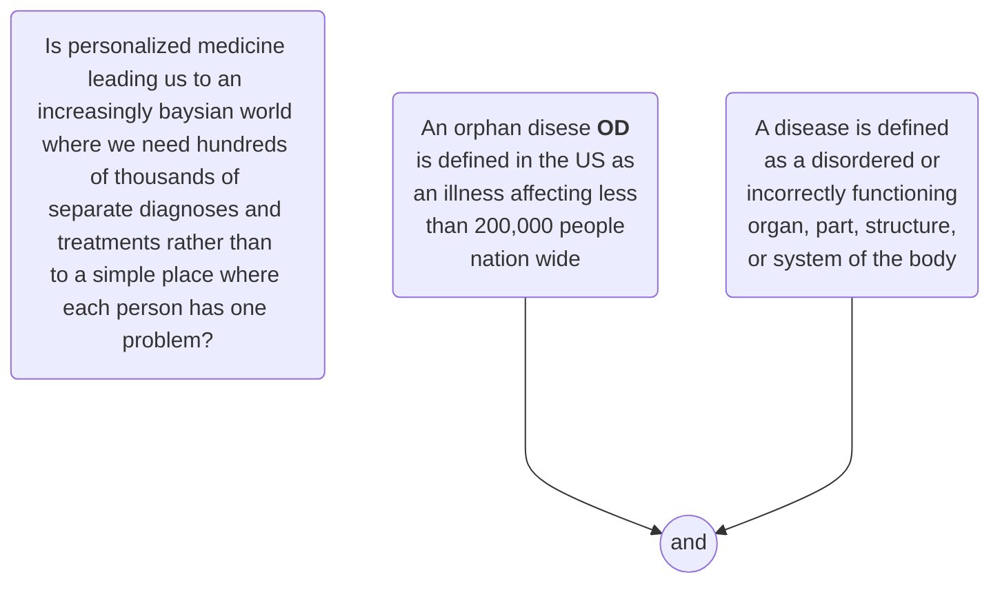

# Orphan Diseases

```mermaid
flowchart TD
proposition(Is personalized medicine <br>leading us to an <br>increasingly baysian world <br>where we need hundreds <br>of thousands of <br>separate diagnoses and <br>treatments rather than <br>to a simple place where <br>each person has one problem?)

orphan(An orphan disese <b>OD</b> <br>is defined in the US as <br>an illness affecting less <br>than 200,000 people <br> nation wide)
disease(A disease is defined <br>as a disordered or <br>incorrectly functioning <br>organ, part, structure, <br>or system of the body)
and1((and))
    orphan--->and1
    disease--->and1
```
