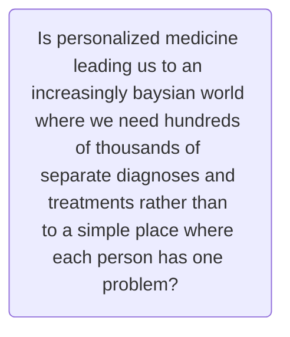

# Orphan Diseases

```mermaid
flowchart TD
proposition(Is personalized medicine <br>leading us to an <br>increasingly baysian world <br>where we need hundreds <br>of thousands of <br>separate diagnoses and <br>treatments rather than <br>to a simple place where <br>each person has one problem?)


```
