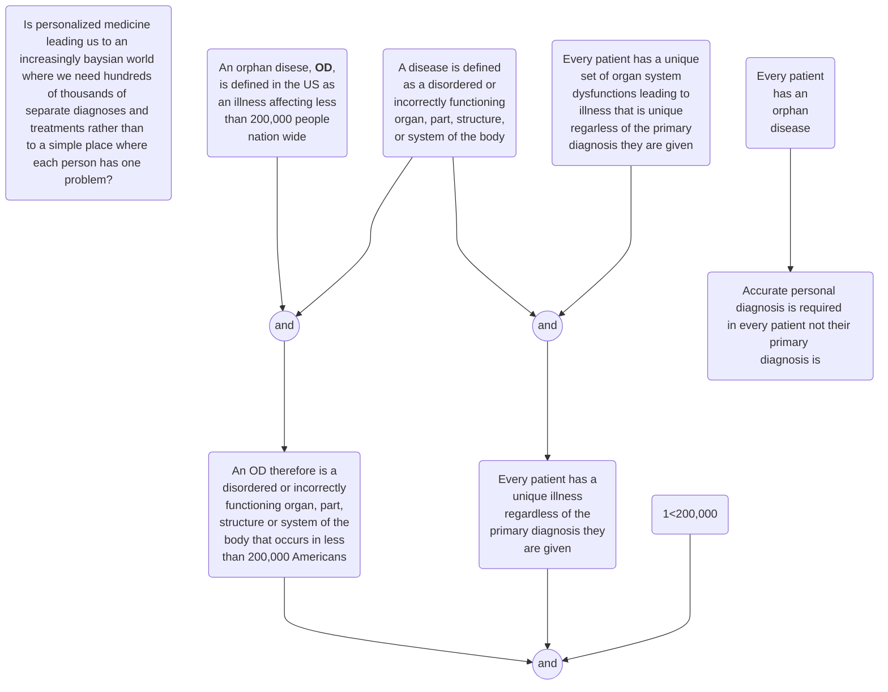

# Orphan Diseases

```mermaid
flowchart TD
proposition(Is personalized medicine <br>leading us to an <br>increasingly baysian world <br>where we need hundreds <br>of thousands of <br>separate diagnoses and <br>treatments rather than <br>to a simple place where <br>each person has one problem?)

orphan(An orphan disese, <b>OD</b>, <br>is defined in the US as <br>an illness affecting less <br>than 200,000 people <br> nation wide)
disease(A disease is defined <br>as a disordered or <br>incorrectly functioning <br>organ, part, structure, <br>or system of the body)
and1((and))
    orphan--->and1
    disease--->and1
every_pt(Every patient has a unique <br>set of organ system <br>dysfunctions leading to <br>illness that is unique <br>regarless of the primary <br>diagnosis they are given)
and2((and))
    every_pt--->and2
    disease--->and2
OD_def(An OD therefore is a <br>disordered or incorrectly <br> functioning organ, part, <br>structure or system of the <br>body that occurs in less <br>than 200,000 Americans)
    and1--->OD_def
every_pt2(Every patient has a <br>unique illness <br>regardless of the <br> primary diagnosis they <br>are given)
    and2--->every_pt2
logic(1<200,000)
and3((and))
    OD_def--->and3
    every_pt2--->and3
    logic--->and3
every_pt3(Every patient <br>has an <br>orphan <br>disease)
accurate(Accurate personal <br>diagnosis is required <br>in every patient not <brmatter how common <br>their primary <br>diagnosis is)
    every_pt3--->accurate


```
